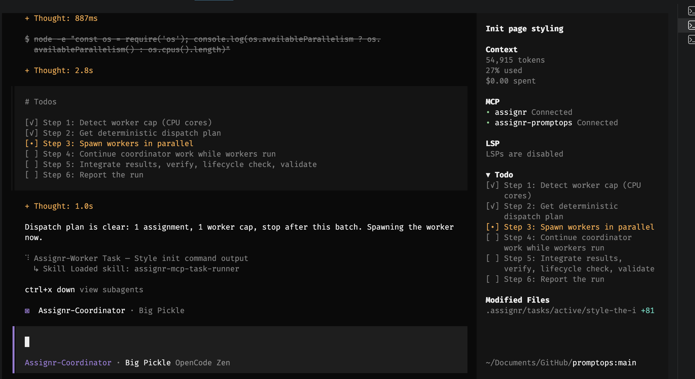
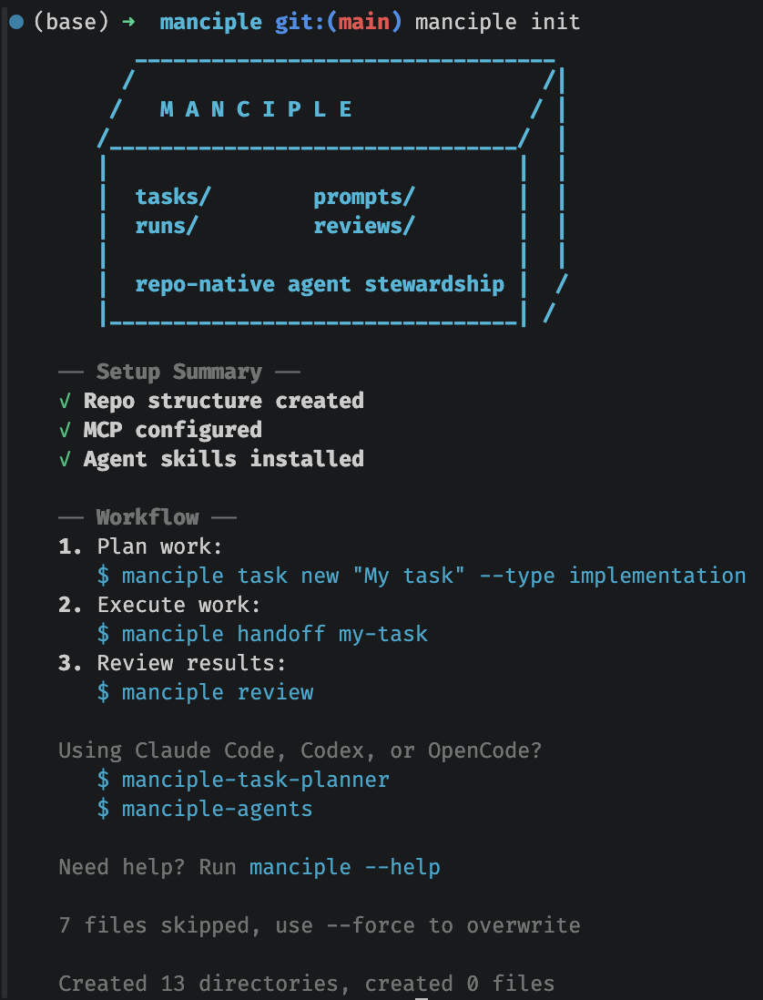

 _ __ ___    __ _  _ __    ___ (_) _ __  | |  ___ 
| '_ ` _ \  / _` || '_ \  / __|| || '_ \ | | / _ \
| | | | | || (_| || | | || (__ | || |_) || ||  __/
|_| |_| |_| \__,_||_| |_| \___||_|| .__/ |_| \___|
                                  |_|             

Repo-native task orchestration for coding agents.

> **Formerly known as Assignr.** The project was renamed to Manciple; the workflow and goals remain the same.

A manciple is a steward of provisions. Manciple does the same for coding agents: it keeps scoped work, prompts, run logs, and review evidence organized inside your repository.

Manciple stores scoped YAML task specifications, generated prompts, run logs, and review evidence directly in your repository. Every task defines a clear contract—goal, allowed paths, acceptance criteria, verification commands, and required evidence—so agents can work independently while humans review with confidence.


## Demo

Before Manciple, agent handoffs often start as a useful but risky blob:

> Can you clean up login? The errors are confusing, the tests are flaky, and
> support says password reset broke after the session refactor. Please fix what
> you find and make sure auth still works.

After Manciple, that work becomes one scoped task an agent can run and a reviewer
can check in about 30 seconds:

```bash
manciple new "Fix password reset session handling" --type implementation --domain auth --priority high
manciple handoff fix-password-reset-session-handling
```

```yaml
goal: Fix password reset failures caused by the session refactor.
acceptance_criteria:
  - Expired reset links show a clear error.
  - Valid reset links create a fresh session.
allowed_paths:
  - src/features/auth/**
  - tests/auth/**
verification:
  commands:
    - pnpm test -- auth
outputs_required:
  - files_changed
  - tests_run
  - risks
```



## Install

Requires Node.js 18+.

```bash
npm install -g manciple
manciple --help
```

## Quickstart

Initialize a repo, create a task, validate it, check the queue, and compile an
agent prompt:

```bash
manciple init
```



```bash
manciple new "Build login page" --type implementation --domain auth --priority high
manciple validate
manciple status
manciple handoff build-login-page
```

The new task lives in `.manciple/tasks/active/build-login-page.yaml`. The
compiled prompt is written to
`.manciple/prompts/generated/build-login-page.md` and can be pasted into Claude
Code, Codex, Cursor, Aider, Goose, or another coding agent.

After the agent runs, record evidence and move the task to review:

```bash
manciple run-log build-login-page \
  --result complete \
  --agent Codex \
  --model gpt-5-codex \
  --command "pnpm test -- auth" \
  --file "src/features/auth/LoginPage.tsx" \
  --risks "No known risks."

manciple set-status build-login-page needs_review
manciple review build-login-page
```

For a more detailed first-run walkthrough, see
[Getting Started](docs/getting-started.md).

## What Manciple Creates

```text
.manciple/
  config.yaml
  domains.yaml
  tasks/
    active/      # pending, in-progress, blocked, and needs-review work
    completed/   # accepted or finished task history
    archived/    # abandoned or superseded task history
  prompts/generated/
  runs/
  reviews/
```

Task specs are plain YAML. A compact task usually looks like this:

```yaml
id: build-login-page
title: Build login page
status: pending
type: implementation
domain: auth
priority: high
goal: Implement email/password login with session handling.
acceptance_criteria:
  - User can log in with valid credentials.
  - Invalid credentials return a clear error.
allowed_paths:
  - src/features/auth/**
verification:
  commands:
    - pnpm test -- auth
outputs_required:
  - files_changed
  - tests_run
  - risks
```

## Command Reference

| Command                                   | Purpose                                                                             |
| ----------------------------------------- | ----------------------------------------------------------------------------------- |
| `manciple init`                          | Initialize `.manciple/` in a repo.                                                 |
| `manciple new <title>`                   | Create a task spec. Add `--interactive` to collect common fields through prompts.   |
| `manciple validate`                      | Validate task specs.                                                                |
| `manciple handoff [task-id]`             | Compile a task prompt, or inspect the worker queue. See `manciple handoff --help`. |
| `manciple list`                          | List active task specs.                                                             |
| `manciple status`                        | Show status counts and a suggested next task.                                       |
| `manciple run-log <task-id>`             | Create a run log with commands, files, result, model, agent, and risks.             |
| `manciple set-status <task-id> <status>` | Update task status.                                                                 |
| `manciple review <task-id>`              | Generate a reviewer prompt.                                                         |
| `manciple review-check [task-id]`        | Check review readiness evidence.                                                    |
| `manciple doctor`                        | Check repo configuration.                                                           |
| `manciple mcp-config`                    | Create or update `.mcp.json` for the Manciple MCP server.                          |

## Deeper Docs

- [Getting Started](docs/getting-started.md): a fuller first-run workflow.
- [Task Lifecycle](docs/task-lifecycle.md): active, completed, archived, and
  migration behavior.
- [Parallel Workflows](docs/parallel-workflows.md): dependencies, path
  ownership, worktrees, and coordinator loops.
- [Evidence and Review](docs/evidence-and-review.md): run logs, review prompts,
  review checks, and reviewer decisions.
- [Review Queue](docs/review-queue.md): triage and deep-review workflows for
  batches of `needs_review` tasks.
- [MCP Server](docs/mcp-server.md): MCP setup and tool surface.
- [OpenCode Agents](docs/opencode-agents.md): manciple-worker and
  manciple-coordinator agents for OpenCode.
- [Agent Skills](docs/agent-skills.md): Claude Code and Codex skill files for
  Manciple workflows.

## Package

- npm: `manciple`
- CLI: `manciple`
- MCP binary: `manciple-mcp`
- Agent assets: packaged docs include [Agent Skills](docs/agent-skills.md) for
  `.codex/skills/` and `.claude/skills/`, plus
  [OpenCode Agents](docs/opencode-agents.md) for `.opencode/agents/`.
- License: MIT

## Contributing

We welcome contributions! See [CONTRIBUTING.md](CONTRIBUTING.md) for development setup, code style, pull request process, and how to report issues.
